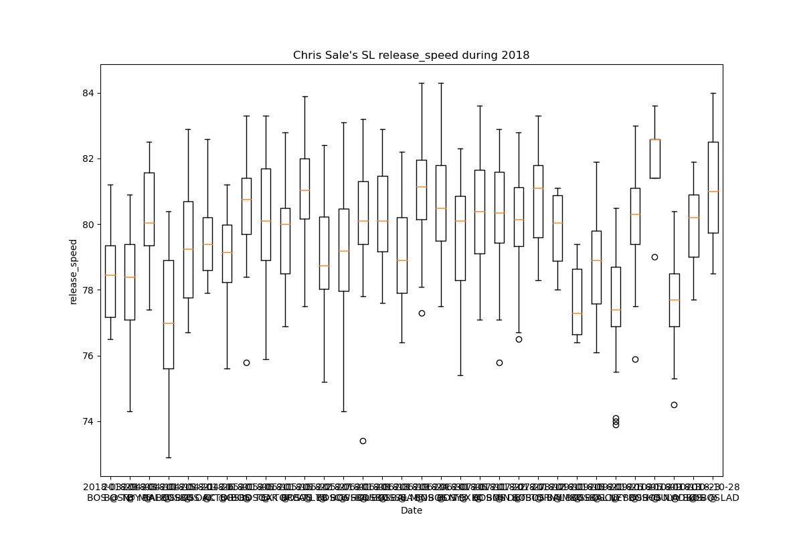

# MLB

## Get started
### Install dependencies
You will need to install the following:
- [Python 3](https://www.python.org/downloads/)
- [pip](https://pip.pypa.io/en/stable/installing/)
- [Git](https://git-scm.com/downloads)

Then, the dependencies can be installed using the following command:
```bash
pip install -r requirements.txt
```

## Statcast
Using the [pybaseball](https://github.com/jldbc/pybaseball) package, we can pull Statcast data from Baseball Savant. The data is stored in a Pandas DataFrame, which can be manipulated and analyzed using the Pandas library. Thus far, I have used the data to create a few visualizations of the data, namely: 
- Pitcher report card on release (colour on pitch type) and homeplate (colour on result of the play).

For example, homeplate report card for David Price on 2018-10-28, game 5 of the 2018 World Series:

and the release report card for the same game:


- Team report on hits (colour on result of the play)

For example, team report for the Boston Red Sox against the Dodgers' pitchers on 2018-10-28, game 5 of the 2018 World Series:


- Pitcher analysis for each pitch type on various metrics (e.g. release speed, effective speed, spin rate, extension, etc.)

For example, pitcher analysis for Chris Sale's slider on 2018-10-28, game 5 of the 2018 World Series:


## UmpScorecard
Using the [pybaseball](https://github.com/jldbc/pybaseball) package, we can also work on getting a report of the umpire's performance for the game. The data is stored in a Pandas DataFrame, which can be manipulated and analyzed using the Pandas library. Thus far, I have used the data to create a few visualizations of the data, namely:
- Plotting the wrong calls (balls inside the strike zone and strikes outside the strike zone) on a scatter plot of the strike zone.
- Computing the run value of wrong calls for both pitchers and batters, and for each team, from which we can derive the total run value of wrong calls for the game.

For example, the wrong calls when the Red Sox are pitching for the 2018-10-28, game 5 of the 2018 World Series:


So far, the results are interesting but are far from the values computed by [@UmpScorecards](https://twitter.com/UmpScorecards) on Twitter. I am still working on figuring out why the values are so different.

## Pitcher Report

Using the [pybaseball](https://github.com/jldbc/pybaseball), I created a way to analyse release speed, effective speed and spin rate at release for a pitcher through time. I also added a kernel estimator for the position of pitches during a year, using the [seaborn](https://seaborn.pydata.org/) library.

For example, the release speed of Chris Sale's slider during the 2018 season:

And the kernel estimator for the position of Chris Sale's slider during the 2018 season:


## Next steps
Some features I would like to add:
- Add a feature by searching by pitcher or by team instead of by date (yesterday being the main use case, however)
- ...